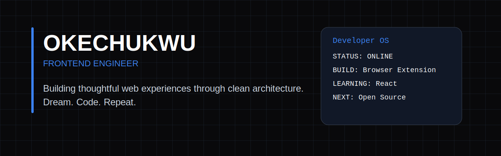

<p align="center">
  
</p>

<!-- <p align="center">
  
</p> -->

---

## About Me

I'm a Frontend Engineer passionate about building responsive, accessible, and high-performance web applications.

I enjoy transforming ideas into polished digital experiences through clean architecture, thoughtful UI, and continuous learning.

Currently focused on shipping real-world projects, deepening my React expertise, and contributing to open source.

---


## Developer OS

```console
> booting developer.profile...

Name          : Okechukwu
Role          : Frontend Engineer
Status        : 🟢 Building
Mission       : Building products people genuinely enjoy using.

Current Build : Browser Extension
Learning      : React • Performance • Accessibility
Next Target   : Open Source Contributions

Version       : v1.0.0
```


## Tech Stack

<p align="center">

</p>

## GitHub Analytics

## 📊 GitHub Analytics

<p align="center">
  

  
</p>

<p align="center">
  
</p>

## 🚀 Featured Projects

### 🌤️ Weather App
A responsive weather application that provides real-time weather conditions, 5-day forecasts, geolocation support, and search history.

**Tech Stack:** HTML • CSS • JavaScript • Open-Meteo API

[](https://weatherly.sa.pipeops.app)


---

### 📝 Form Validation
A modern registration form featuring real-time validation, error handling, and a responsive user interface.

**Tech Stack:** HTML • CSS • JavaScript

[](https://formzen.sa.pipeops.app/)

---

### 🧩 Browser Extension *(In Progress)*
A productivity-focused browser extension designed to streamline daily workflows with a clean, distraction-free interface.

**Tech Stack:** HTML • CSS • JavaScript

🔗 **Status:** Currently in development

---

<p align="center">

**Dream. Code. Repeat.**

Building one commit at a time.

</p>