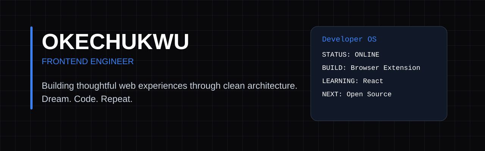

<p align="center">
  
</p>

<!-- <p align="center">
  
</p> -->

---

## About Me

I'm a Frontend Engineer passionate about building responsive, accessible, and high-performance web applications.

I enjoy transforming ideas into polished digital experiences through clean architecture, thoughtful UI, and continuous learning.

Currently focused on shipping real-world projects, deepening my React expertise, and contributing to open source.

---

## Developer OS

```console
> booting developer.profile...

Name          : Okechukwu
Role          : Frontend Engineer
Status        : 🟢 Building
Mission       : Building products people genuinely enjoy using.

Current Build : Browser Extension
Learning      : React • Performance • Accessibility
Next Target   : Open Source Contributions

Version       : v1.0.0
```

## Tech Stack

<p align="center">

</p>

<!-- Featured Projects Section -->
<h3 align="center">Featured Projects</h3>

<table width="100%" cellpadding="10" cellspacing="0" border="0">
  <!-- ROW 1 -->
  <tr valign="top">
    <!-- Project Card 1 -->
    <td width="50%" align="center">
      <a href="https://product-catalog-spa-three.vercel.app/">
        
      </a>
      <a href="https://product-catalog-spa-three.vercel.app/"><strong>SPA Landing</strong></a>
      <p align="justify"><font face="Georgia" size="2">A comprehensive Product Catalog Single-Page Application using modern React, TypeScript, & Tailwind CSS featuring real-time product discovery.</font></p>
      <p align="center">
        <code>React</code> &nbsp; <code>TypeScript</code> &nbsp; <code>TailwindCSS </code> &nbsp; <code>Vite</code> &nbsp; <code>shadcn/ui</code>
      </p>
    </td>
    <!-- Project Card 2 -->
    <td width="50%" align="center">
      <a href="https://github.com/Xinfinitygen/Browser-extension-manager-UI.git">
        
      </a>
      <a href="https://browser-extension-manager.sa.pipeops.app/"><strong>Browser Extension</strong></a>
      <p align="justify"><font face="Georgia" size="2">A productivity-focused browser extension designed to streamline daily workflows with a clean, distraction-free user interface.</font></p>
      <p align="center">
        <code>HTML5</code> &nbsp; <code>CSS3</code> &nbsp; <code>JavaScript(ES6)</code> &nbsp;<code>Local Storage API</code>
      </p>
    </td>
  </tr>

  <!-- ROW 2 -->
  <tr valign="top">
    <!-- Project Card 3 -->
    <td width="50%" align="center">
      <a href="https://weatherly.sa.pipeops.app/">
        
      </a>
      <a href="https://weatherly.sa.pipeops.app/"><strong>Weather App</strong></a>
      <p align="justify"><font face="Georgia" size="2">A responsive weather application providing real-time conditions, 5-day forecasts, geolocation support, and deep search history.</font></p>
      <p align="center">
        <code>HTML5</code> &nbsp; <code>CSS3</code> &nbsp; <code>JavaScript(ES6)</code>
      </p>
    </td>
    <!-- Project Card 4 -->
    <td width="50%" align="center">
      <a href="https://github.com/Xinfinitygen/browser-extension-manager-v2.git">
        
      </a>
      <a href="https://xinfinitygen.github.io/browser-extension-manager-v2/"><strong>Browser Extension V2</strong></a>
      <p align="justify"><font face="Georgia" size="2">The refined second iteration of the Browser Extention Manager, introducing real-time search, active/inactive filtering, persistent theme switching, and a dedicated recovery panel that lets users restore removed extensions without losing them.</font></p>
      <p align="center">
        <code>HTML5</code> &nbsp; <code>CSS3</code> &nbsp; <code>JavaScript(ES6)</code> &nbsp;<code>Local Storage API</code>
      </p>
    </td>

  <!-- ROW 3 (Future Slot 5 & 6) -->
  <tr valign="top">
    <!-- Project Card 5 -->
    <td width="50%" align="center">
      <!-- Future Project 5 Content -->
    </td>
    <!-- Project Card 6 -->
    <td width="50%" align="center">
      <!-- Future Project 6 Content -->
    </td>
  </tr>

  <!-- ROW 4 (Future Slot 7 & 8) -->
  <tr valign="top">
    <!-- Project Card 7 -->
    <td width="50%" align="center">
      <!-- Future Project 7 Content -->
    </td>
    <!-- Project Card 8 -->
    <td width="50%" align="center">
      <!-- Future Project 8 Content -->
    </td>
  </tr>
</table>
<p align="center">

**Dream. Code. Repeat.**

Building one commit at a time.

</p>